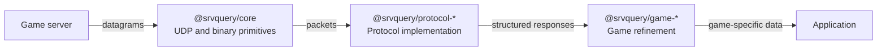

# srvquery


> [!WARNING]
> This project is under active construction. APIs and package behavior may change without notice.

The composable TypeScript toolkit for querying game servers.

## Architecture



Each layer can be used independently. Protocol packages build on `@srvquery/core`, while game packages refine generic protocol results without replacing the underlying protocol client.

## Packages

| Package                                                         | Purpose                                        |
| --------------------------------------------------------------- | ---------------------------------------------- |
| [`@srvquery/core`](packages/core)                               | UDP transport and binary parsing primitives    |
| [`@srvquery/protocol-valve`](packages/protocols/protocol-valve) | Valve server query protocol client and schemas |
| [`@srvquery/game-dayz`](packages/games/game-dayz)               | DayZ-specific refinement of Valve rules        |

## Game support

> [!WARNING]
> The list of supported games is currently very small.

Need support for another game? [Create an issue](https://github.com/carlos-menezes/srvquery/issues/new) with the game and server protocol details.

## Installation

Install the layers needed by your application:

```sh
pnpm add @srvquery/core @srvquery/protocol-valve @srvquery/game-dayz
```

## Usage

```ts
import { UdpQuerySocket } from "@srvquery/core";
import { dayzRuleParser } from "@srvquery/game-dayz";
import { createValveProtocol } from "@srvquery/protocol-valve";

using socket = new UdpQuerySocket({
  host: "127.0.0.1",
  port: 2302,
});

const valve = createValveProtocol({ socket });
const info = await valve.query("INFO");
const dayz = await valve.query("RULES", { parser: dayzRuleParser });

console.log(`${info.name}: ${info.players}/${info.maxPlayers}`);
console.log(dayz.mods);
```

## Development

### Requirements

- Node.js `v24.14.1`, pinned in [`.node-version`](.node-version)
- Corepack

Install or activate the Node.js version in `.node-version` with your preferred version manager. The repository also pins pnpm through the `packageManager` field in `package.json`; enable Corepack and install that pnpm version before installing dependencies:

```sh
corepack enable
corepack install
pnpm install
```

### Commands

Run commands from the repository root:

```sh
pnpm build
pnpm test
pnpm lint
pnpm fmt:check
```

Build a specific package layer when working on a narrower change:

```sh
pnpm build:packages:core
pnpm build:packages:protocols
pnpm build:packages:games
```

Apply automatic formatting or lint fixes with:

```sh
pnpm fmt
pnpm lint:fix
```
