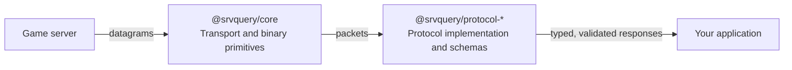

  

> [!WARNING]
> This project is under active construction. APIs and package behavior may change without notice.

**srvquery** is a composable, fully-typed TypeScript toolkit for querying game servers.

It gives you raw binary and transport primitives (`@srvquery/core`) alongside ready-to-use, schema-validated protocol clients (`@srvquery/protocol-*`) so you can fetch a server's status, player list and rules with a single `await`, or drop down to the wire format and build your own protocol on top of the same building blocks.

```ts
import { createValveProtocol } from "@srvquery/protocol-valve";

const server = createValveProtocol({ host: "127.0.0.1", port: 27015 });
const info = await server.query({ opcode: "INFO" });

console.log(`${info.name}: ${info.map} (${info.players}/${info.maxPlayers})`);
```

## Architecture



`@srvquery/core` owns everything protocol-agnostic: opening and closing connections, matching requests to responses, retrying failed attempts and reading/writing binary payloads through [`BufferCursor`](packages/core). Protocol packages build request packets, reassemble and decode responses using `core`'s primitives, validate the result against a schema and return a plain, structured object. Each layer can be consumed independently: for example, you could use only `@srvquery/core` to implement a protocol this repository doesn't ship yet.

## Packages

| Package                                                           | Version                                                                                                                       | Purpose                                                        |
| ----------------------------------------------------------------- | ----------------------------------------------------------------------------------------------------------------------------- | -------------------------------------------------------------- |
| [`@srvquery/core`](packages/core)                                 | [](https://www.npmjs.com/package/@srvquery/core)                       | UDP/HTTP transport and binary parsing primitives               |
| [`@srvquery/protocol-valve`](packages/protocols/protocol-valve)   | [](https://www.npmjs.com/package/@srvquery/protocol-valve)   | Valve server query protocol client and schemas                 |
| [`@srvquery/protocol-openmp`](packages/protocols/protocol-openmp) | [](https://www.npmjs.com/package/@srvquery/protocol-openmp) | SA-MP / open.mp server query protocol client and schemas       |
| [`@srvquery/protocol-fivem`](packages/protocols/protocol-fivem)   | [](https://www.npmjs.com/package/@srvquery/protocol-fivem)   | FiveM / RedM (FXServer) HTTP query protocol client and schemas |

## Installation

Install the layers needed by your application. Most consumers only need one protocol package, which pulls in `@srvquery/core` as a dependency automatically:

```sh
pnpm add @srvquery/protocol-valve
# or
pnpm add @srvquery/protocol-openmp
# or
pnpm add @srvquery/protocol-fivem
```

Add `@srvquery/core` directly only if you need its transport or binary primitives on their own (for example, to implement a new protocol):

```sh
pnpm add @srvquery/core
```

## Core concepts

### Type-safe responses

Every query is generic over its `opcode`, so the return type of `query(...)` is inferred automatically.

```ts
const info = await server.query({ opcode: "INFO" }); // ValveServerInfo
const players = await server.query({ opcode: "PLAYERS" }); // ValvePlayers
```

Responses are validated at runtime against a [Zod](https://zod.dev) schema before being returned. If a server sends a malformed or unexpected payload, `query(...)` rejects with a `ZodError` instead of handing your application silently corrupt data.

### Retries and backoff

Protocol clients make up to three attempts for each UDP request by default. Between attempts they use the exported `backoffStrategy`, an exponential delay starting at 100ms.

Customize retries when creating a protocol client:

```ts
import { QueryTransportError, backoffStrategy } from "@srvquery/core";
import { createValveProtocol } from "@srvquery/protocol-valve";

const server = createValveProtocol({
  host: "127.0.0.1",
  port: 27015,
  retry: {
    retries: 5,
    strategy: backoffStrategy,
    fatal: (error) => error instanceof QueryTransportError,
  },
});
```

- `retries` is the total number of attempts, including the first request. Set it to `1` to disable retries entirely.
- `strategy` receives the completed attempt number and returns the delay in milliseconds before the next attempt: supply your own function for linear, jittered, or fixed-delay backoff.
- `fatal` can stop retrying immediately for errors that retries can't fix (for example, an unreachable host).

### Error handling

Queries can fail in two distinct ways, both exported from `@srvquery/core` so you can branch on `instanceof`:

| Error                 | Thrown when                                                                                                |
| --------------------- | ---------------------------------------------------------------------------------------------------------- |
| `QueryTimeoutError`   | No response was received within the timeout window, after all retries were exhausted.                      |
| `QueryTransportError` | A transport-level failure occurred: a socket error, a non-2xx HTTP response, or a malformed response body. |

```ts
import { QueryTransportError, QueryTimeoutError } from "@srvquery/core";

try {
  const info = await server.query({ opcode: "INFO" });
} catch (error) {
  if (error instanceof QueryTimeoutError) {
    console.error(`${error.host}:${error.port} did not respond after ${error.attempts} attempt(s)`);
  } else if (error instanceof QueryTransportError) {
    console.error("Transport failure:", error.cause);
  } else {
    throw error;
  }
}
```

### Socket lifecycle

Every `query(...)` call opens a socket scoped to that single request response exchange and closes it automatically: you never have to manage a connection pool or worry about leaking file descriptors. If you work with `@srvquery/core`'s `createUdpSocket` directly, the same guarantee is available through [explicit resource management](https://github.com/tc39/proposal-explicit-resource-management):

```ts
import { createUdpSocket } from "@srvquery/core";

using socket = createUdpSocket({ host: "127.0.0.1", port: 27015 });
// socket.close() runs automatically when `socket` leaves scope
```

## Development

### Requirements

- Node.js `v24.14.1`, pinned in [`.node-version`](.node-version)
- Corepack

Install or activate the Node.js version in `.node-version` with your preferred version manager. The repository also pins pnpm through the `packageManager` field in `package.json`; enable Corepack and install that pnpm version before installing dependencies:

```sh
corepack enable
corepack install
pnpm install
```

### Commands

Run commands from the repository root:

```sh
pnpm build       # build every package (rolldown + tsc), respecting dependency order
pnpm test        # run every package's Vitest suite
pnpm lint        # lint with oxlint
pnpm fmt:check   # verify formatting with oxfmt
```

Build a specific package layer when working on a narrower change:

```sh
pnpm build:packages:core
pnpm build:packages:protocols
```

Apply automatic formatting or lint fixes with:

```sh
pnpm fmt
pnpm lint:fix
```

## Contributing

- Commits follow [Conventional Commits](https://www.conventionalcommits.org) and are linted by [commitlint](commitlint.config.mjs) via a Husky `commit-msg` hook.
- Staged files are linted and formatted automatically before each commit through [lint-staged](lint-staged.config.mjs).
- CI (see [`.github/workflows/ci.yml`](.github/workflows/ci.yml)) runs the same format check, lint, and build steps required locally: make sure `pnpm fmt:check`, `pnpm lint`, and `pnpm build` pass before opening a pull request.
