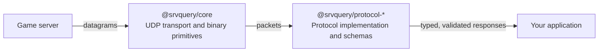

  

> [!WARNING]
> This project is under active construction. APIs and package behavior may change without notice.

**srvquery** is a composable, fully-typed TypeScript toolkit for querying game servers over UDP.
It gives you raw binary and transport primitives (`@srvquery/core`) alongside ready-to-use, schema-validated protocol clients (`@srvquery/protocol-*`) so you can fetch a server's status, player list and rules with a single `await`, or drop down to the wire format and build your own protocol on top of the same building blocks.

```ts
import { createValveProtocol } from "@srvquery/protocol-valve";

const server = createValveProtocol({ host: "127.0.0.1", port: 27015 });
const info = await server.query({ opcode: "INFO" });

console.log(`${info.name} — ${info.map} (${info.players}/${info.maxPlayers})`);
```

## Table of contents

- [Why srvquery](#why-srvquery)
- [Architecture](#architecture)
- [Supported protocols](#supported-protocols)
- [Packages](#packages)
- [Installation](#installation)
- [Quick start](#quick-start)
- [Core concepts](#core-concepts)
  - [Type-safe responses](#type-safe-responses)
  - [Retries and backoff](#retries-and-backoff)
  - [Error handling](#error-handling)
  - [Socket lifecycle](#socket-lifecycle)
- [Protocol guides](#protocol-guides)
  - [Valve server query protocol](#valve-server-query-protocol)
  - [SA-MP / open.mp](#sa-mp--openmp)
- [Development](#development)
- [Contributing](#contributing)
- [References](#references)

## Why srvquery

- **Composable by design** — use the transport layer, the protocol layer, or both. Nothing is
  bundled together, so your application only pays for what it imports.
- **Fully typed, end to end** — every query is generic over its opcode, and every response is
  validated at runtime with [Zod](https://zod.dev) and inferred back into a static TypeScript type.
  There is no `any` between the socket and your application code.
- **Resilient by default** — UDP is unreliable and game servers drop or ignore malformed packets.
  Every protocol client retries with exponential backoff out of the box, and the retry policy is
  fully overridable.
- **Correct where it's hard** — Valve's protocol multiplexes challenge/response handshakes and
  fragmented ("multi-packet") responses transparently; the DayZ/Arma 3 "Server Browser Protocol"
  nested inside `A2S_RULES` is decoded into structured mod, DLC, and difficulty data instead of
  being left as an opaque blob.
- **Modern tooling, minimal footprint** — ESM-only, built with [rolldown](https://rolldown.rs),
  linted and formatted with [oxlint](https://oxc.rs)/[oxfmt](https://oxc.rs), tested with
  [Vitest](https://vitest.dev), and orchestrated with [Turborepo](https://turborepo.com).

## Architecture



`@srvquery/core` owns everything protocol-agnostic: opening and closing UDP sockets, matching
requests to responses, retrying failed attempts, and reading/writing binary payloads through
[`BufferCursor`](packages/core). Protocol packages build request packets, reassemble and decode
responses using `core`'s primitives, validate the result against a schema, and return a plain,
structured object. Each layer can be consumed independently — for example, you could use only
`@srvquery/core` to implement a protocol this repository doesn't ship yet.

## Supported protocols

| Protocol                                                          | Games                                                                                                         | Opcodes                                                        |
| ----------------------------------------------------------------- | ------------------------------------------------------------------------------------------------------------- | -------------------------------------------------------------- |
| [`@srvquery/protocol-valve`](packages/protocols/protocol-valve)   | Counter-Strike, Team Fortress 2, Garry's Mod, Rust, ARK, DayZ, Arma 3, and other Source/GoldSrc-based servers | `INFO`, `PLAYERS`, `RULES`, `PING`, `SERVERQUERY_GETCHALLENGE` |
| [`@srvquery/protocol-openmp`](packages/protocols/protocol-openmp) | GTA:SA multiplayer — SA-MP and open.mp                                                                        | `INFO`, `RULES`, `CLIENT_LIST`, `PLAYERS`, `PING`              |

More protocol packages are planned; see [Development](#development) for how the workspace is set
up to add new ones.

## Packages

| Package                                                           | Version                                                                                                                       | Purpose                                                  |
| ----------------------------------------------------------------- | ----------------------------------------------------------------------------------------------------------------------------- | -------------------------------------------------------- |
| [`@srvquery/core`](packages/core)                                 | [](https://www.npmjs.com/package/@srvquery/core)                       | UDP transport and binary parsing primitives              |
| [`@srvquery/protocol-valve`](packages/protocols/protocol-valve)   | [](https://www.npmjs.com/package/@srvquery/protocol-valve)   | Valve server query protocol client and schemas           |
| [`@srvquery/protocol-openmp`](packages/protocols/protocol-openmp) | [](https://www.npmjs.com/package/@srvquery/protocol-openmp) | SA-MP / open.mp server query protocol client and schemas |

## Installation

Install the layers needed by your application. Most consumers only need one protocol package,
which pulls in `@srvquery/core` as a dependency automatically:

```sh
pnpm add @srvquery/protocol-valve
# or
pnpm add @srvquery/protocol-openmp
```

Add `@srvquery/core` directly only if you need its transport or binary primitives on their own
(for example, to implement a new protocol):

```sh
pnpm add @srvquery/core
```

## Quick start

<table>
<tr>
<th>Valve (Source / GoldSrc)</th>
<th>SA-MP / open.mp</th>
</tr>
<tr>
<td valign="top">

```ts
import { createValveProtocol } from "@srvquery/protocol-valve";

const server = createValveProtocol({
  host: "127.0.0.1",
  port: 27015,
});

const info = await server.query({ opcode: "INFO" });
const players = await server.query({ opcode: "PLAYERS" });
const rules = await server.query({ opcode: "RULES" });

console.log(`${info.name}: ${info.players}/${info.maxPlayers}`);
console.log(players);
console.log(rules);
```

</td>
<td valign="top">

```ts
import { createOpenMPProtocol } from "@srvquery/protocol-openmp";

const server = createOpenMPProtocol({
  host: "127.0.0.1",
  port: 7777,
});

const info = await server.query({ opcode: "INFO" });
const clients = await server.query({ opcode: "CLIENT_LIST" });
const ping = await server.query({ opcode: "PING" });

console.log(`${info.hostname}: ${info.players}/${info.maxPlayers}`);
console.log(clients);
console.log(ping);
```

</td>
</tr>
</table>

## Core concepts

### Type-safe responses

Every query is generic over its `opcode`, so the return type of `query(...)` is inferred
automatically — no casting, no separate generic response type to remember:

```ts
const info = await server.query({ opcode: "INFO" }); // ValveServerInfo
const players = await server.query({ opcode: "PLAYERS" }); // ValvePlayers
```

Responses aren't just cast from a parsed buffer — they're validated at runtime against a
[Zod](https://zod.dev) schema before being returned. If a server sends a malformed or unexpected
payload, `query(...)` rejects with a `ZodError` instead of handing your application silently
corrupt data. All schema and inferred types (`ValveServerInfo`, `OpenMPPlayers`, etc.) are exported
from each protocol package so you can reuse them in your own function signatures.

### Retries and backoff

Protocol clients make up to three attempts for each UDP request by default. Between attempts they
use the exported `backoffStrategy`, an exponential delay starting at 100 ms (100 ms, 200 ms,
400 ms, …).

Customize retries when creating a protocol client:

```ts
import { QuerySocketError, backoffStrategy } from "@srvquery/core";
import { createValveProtocol } from "@srvquery/protocol-valve";

const server = createValveProtocol({
  host: "127.0.0.1",
  port: 27015,
  retry: {
    retries: 5,
    strategy: backoffStrategy,
    fatal: (error) => error instanceof QuerySocketError,
  },
});
```

- `retries` is the total number of attempts, including the first request. Set it to `1` to
  disable retries entirely.
- `strategy` receives the completed attempt number and returns the delay in milliseconds before
  the next attempt — supply your own function for linear, jittered, or fixed-delay backoff.
- `fatal` can stop retrying immediately for errors that retries can't fix (for example, an
  unreachable host).

### Error handling

Queries can fail in two distinct ways, both exported from `@srvquery/core` so you can branch on
`instanceof`:

| Error               | Thrown when                                                                                         |
| ------------------- | --------------------------------------------------------------------------------------------------- |
| `QueryTimeoutError` | No response was received within the timeout window, after all retries were exhausted.               |
| `QuerySocketError`  | A low-level socket failure occurred (DNS resolution failure, `ECONNREFUSED`, `EHOSTUNREACH`, etc.). |

```ts
import { QuerySocketError, QueryTimeoutError } from "@srvquery/core";

try {
  const info = await server.query({ opcode: "INFO" });
} catch (error) {
  if (error instanceof QueryTimeoutError) {
    console.error(`${error.host}:${error.port} did not respond after ${error.attempts} attempt(s)`);
  } else if (error instanceof QuerySocketError) {
    console.error("Socket failure:", error.cause);
  } else {
    throw error;
  }
}
```

### Socket lifecycle

Every `query(...)` call opens a socket scoped to that single request/response exchange and closes
it automatically — you never have to manage a connection pool or worry about leaking file
descriptors. If you work with `@srvquery/core`'s `createUdpSocket` directly, the same guarantee is
available through [explicit resource management](https://github.com/tc39/proposal-explicit-resource-management):

```ts
import { createUdpSocket } from "@srvquery/core";

using socket = createUdpSocket({ host: "127.0.0.1", port: 27015 });
// socket.close() runs automatically when `socket` leaves scope
```

## Protocol guides

### Valve server query protocol

Wire-level reference: [Valve Developer Community — Server queries](https://developer.valvesoftware.com/wiki/Server_queries).

| Opcode                     | Wire value | Query           | Response                                                         |
| -------------------------- | ---------- | --------------- | ---------------------------------------------------------------- |
| `INFO`                     | `T` (0x54) | `A2S_INFO`      | Name, map, folder, game, player/bot counts, VAC status, and more |
| `PLAYERS`                  | `U` (0x55) | `A2S_PLAYER`    | Connected players: index, name, score, connected duration        |
| `RULES`                    | `V` (0x56) | `A2S_RULES`     | Server-defined key/value rules                                   |
| `PING`                     | `i` (0x69) | Legacy ping     | Round-trip latency payload (deprecated by most servers)          |
| `SERVERQUERY_GETCHALLENGE` | `W` (0x57) | Challenge token | Signed 32-bit challenge, requested transparently when needed     |

Challenge/response handshakes and fragmented ("multi-packet") responses are handled transparently
by `createValveProtocol` — you only ever see the final, decoded response.

#### DayZ and Arma 3 `RULES`

DayZ and Arma 3 embed an additional, nested protocol inside the raw `A2S_RULES` response, sometimes
called the "Server Browser Protocol": key=value rule pairs carry paged, escaped chunks of a binary
message describing DLCs, mods, signatures, and (for DayZ) a server description. The default
`RULES` query only decodes the raw string pairs — pass a game-specific `parser` to decode that
nested message into structured data instead:

- DayZ responds with protocol version `2` — use `serverBrowserProtocol2RulesParser`.
- Arma 3 responds with protocol version `3`, which additionally carries difficulty settings and
  Creator DLC entries — use `serverBrowserProtocol3RulesParser`.

```ts
import { createValveProtocol, serverBrowserProtocol2RulesParser } from "@srvquery/protocol-valve";

const dayz = createValveProtocol({ host: "127.0.0.1", port: 2302 });

const rules = await dayz.query({
  opcode: "RULES",
  parser: serverBrowserProtocol2RulesParser,
});

console.log(rules.mods);
console.log(rules.description);
```

```ts
import { createValveProtocol, serverBrowserProtocol3RulesParser } from "@srvquery/protocol-valve";

const arma3 = createValveProtocol({ host: "127.0.0.1", port: 2302 });

const rules = await arma3.query({
  opcode: "RULES",
  parser: serverBrowserProtocol3RulesParser,
});

console.log(rules.dlcs);
console.log(rules.creatorDlcs);
```

Both parsers throw a version-specific error — see
[`rules/errors.ts`](packages/protocols/protocol-valve/src/rules/errors.ts) — if the response
doesn't match the expected protocol version.

### SA-MP / open.mp

Wire-level reference: [open.mp — SA:MP Query Mechanism](https://open.mp/docs/tutorials/QueryMechanism).

| Opcode        | Wire value | Response                                                           |
| ------------- | ---------- | ------------------------------------------------------------------ |
| `INFO`        | `i`        | Hostname, gamemode, language, player counts, password flag         |
| `RULES`       | `r`        | Server rules (gravity, weather, `weburl`, etc.) as key/value pairs |
| `CLIENT_LIST` | `c`        | Compact player list: name and score                                |
| `PLAYERS`     | `d`        | Detailed player list: id, name, score, ping                        |
| `PING`        | `p`        | Round-trip latency to the server, in milliseconds                  |

```ts
import { createOpenMPProtocol } from "@srvquery/protocol-openmp";

const server = createOpenMPProtocol({ host: "127.0.0.1", port: 7777 });

const rules = await server.query({ opcode: "RULES" });
const players = await server.query({ opcode: "PLAYERS" });

console.log(rules);
console.log(players);
```

## Development

### Requirements

- Node.js `v24.14.1`, pinned in [`.node-version`](.node-version)
- Corepack

Install or activate the Node.js version in `.node-version` with your preferred version manager. The repository also pins pnpm through the `packageManager` field in `package.json`; enable Corepack and install that pnpm version before installing dependencies:

```sh
corepack enable
corepack install
pnpm install
```

### Repository layout

```
packages/
  core/                     @srvquery/core — UDP transport and binary primitives
  protocols/
    protocol-valve/         @srvquery/protocol-valve — Valve server query protocol
    protocol-openmp/        @srvquery/protocol-openmp — SA-MP / open.mp protocol
internal/
  typescript-config/        Shared tsconfig base used by every package
```

Package builds are orchestrated by [Turborepo](https://turborepo.com) (see [`turbo.json`](turbo.json)),
which caches build output and only rebuilds packages affected by a change.

### Commands

Run commands from the repository root:

```sh
pnpm build       # build every package (rolldown + tsc), respecting dependency order
pnpm test        # run every package's Vitest suite
pnpm lint        # lint with oxlint
pnpm fmt:check   # verify formatting with oxfmt
```

Build a specific package layer when working on a narrower change:

```sh
pnpm build:packages:core
pnpm build:packages:protocols
```

Apply automatic formatting or lint fixes with:

```sh
pnpm fmt
pnpm lint:fix
```

## Contributing

- Commits follow [Conventional Commits](https://www.conventionalcommits.org) and are linted by
  [commitlint](commitlint.config.mjs) via a Husky `commit-msg` hook.
- Staged files are linted and formatted automatically before each commit through
  [lint-staged](lint-staged.config.mjs).
- CI (see [`.github/workflows/ci.yml`](.github/workflows/ci.yml)) runs the same format check,
  lint, and build steps required locally — make sure `pnpm fmt:check`, `pnpm lint`, and
  `pnpm build` pass before opening a pull request.

## References

- [Valve Developer Community — Server queries](https://developer.valvesoftware.com/wiki/Server_queries)
- [Arma 3: ServerBrowserProtocol2](https://community.bistudio.com/wiki/Arma_3:_ServerBrowserProtocol2)
- [Arma 3: ServerBrowserProtocol3](https://community.bistudio.com/wiki/Arma_3:_ServerBrowserProtocol3)
- [open.mp — SA:MP Query Mechanism](https://open.mp/docs/tutorials/QueryMechanism)
- [WoozyMasta/a2s `pkg/a3sb`](https://github.com/WoozyMasta/a2s/tree/master/pkg/a3sb) — a Go
  implementation this package's Server Browser Protocol parsers were cross-checked against
